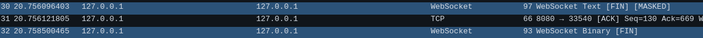
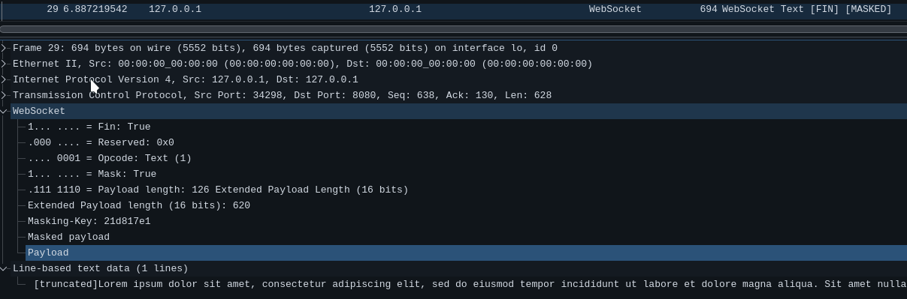
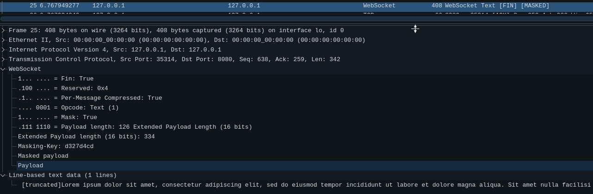

# Websocket example

## Instalation

You can run this example in different ways
- with the docker image, `sinashk/websocket`
- with `yarn`

To run this example with docker you can run on of these command:
- without compression: 

```bash
$ make run
```

- with compression: 

```bash
$ make run-deflate
```

To run this example with yarn you can run one of these commands
- without compression

```bash
$ make build-run
```

- with compression: 

```bash
$ make build-run-deflate
```

## Explaination

We run the server with `make run`. The site is hosted on `localhost:8080`. After openning the website, it will connect to `ws://localhost:8080/chat`, which is used to handle `Websocket` connections. Then you can write in the text box and server will send a broadcast to all clients including the sender. After sending a message, with only one client, we can see that there are to messages with `Websocket` as their protocol. The first one is comming from the client (browser) and the other one is the reponse from the server, which is replying the same message that the client has sent. As you can see client's packet is `masked`. The reason is that the only place that can mess with the connection is in client's code since it's distributed everywhere. To prevent this browser's native `Websocket` object adds a mask to each packet to an attacker can't do anything bad to the server.



Now for the extention we will send a larger text so the effect of compression is more visible to us. To run without compression we can again run `make run` or `make build-run` and after sending a message we can see in wireshark that the length of the packet is 694 and the payload length 620.



Now to run the server with compression we can do it with either `make run-deflate` or `make build-run-deflate`.



As you can see the payload length is 334 which is almost half the size of previous state.
